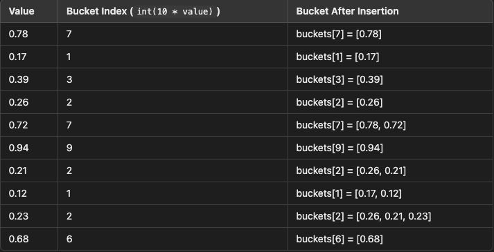

# Algorithms workouts

## Arrays 

### Dynamic Arrays

#### Key Characteristics

1. Contiguous Memory: Elements are stored in contiguous memory locations, allowing for efficient access by index.

2. Dynamic Resizing: The array can grow or shrink as needed, though resizing usually involves some overhead.

#### How Dynamic Arrays Work

1. Initial Size and Capacity:

* A dynamic array starts with a certain initial capacity. The capacity is the total number of elements the array can hold before needing to resize.

2. Adding Elements:

* As elements are added, they are placed in the available slots of the array.

* When the array reaches its capacity, it resizes itself to accommodate more elements.

3. Resizing:

* When the current array is full and a new element needs to be added, the array allocates a new block of memory, typically double the size of the current capacity.

* All existing elements are copied to the new memory block, and the old memory block is freed.

4. Efficiency:

* Access: O(1) time complexity for accessing elements by index.

* O(1) average time complexity for adding elements, although individual additions may sometimes require O(n) time due to resizing.

* Resizing Cost: The amortized cost of resizing is spread out over many insertions, making the average time per insertion O(1).

[Dynamic Array](dynamic_array.py)

### Binary Search

#### Steps of Binary Search

1. Initialize: Start with two pointers, one at the beginning (low) and one at the end (high) of the array.

2. Middle Point: Calculate the middle point of the current interval. ``` mid = low + (high - low) // 2 ```

3. Comparison:

    * If the middle element is equal to the target value, the search is complete.

    * If the target value is less than the middle element, adjust the high pointer to mid - 1.

    * If the target value is greater than the middle element, adjust the low pointer to mid + 1.

4. Repeat: Repeat steps 2 and 3 until the low pointer is greater than the high pointer.

[Binary Search](binary_search.py)
[Search 2D Matrix](search_2d_matrix.py)


### Two Pointers

#### Concept:

* Two pointers is a technique used to iterate through an array or list with two variables pointing to different indices.

* Common use cases include problems involving pairs, triplets, or partitions within an array.

#### Applications:

* Sorted Arrays: Finding pairs that sum to a specific target.

* Linked Lists: Detecting cycles, finding the middle element.

* String Manipulation: Palindrome checking, string reversal.

[Two Pointers - Two Sum 2](two_sum_2.py)

### Sliding Window

#### Concept:

* The sliding window technique involves maintaining a window that slides over the data structure to optimize the solution's performance.

* It is particularly useful for problems involving subarrays, substrings, or sequences.

#### Types of Sliding Windows:

1. Fixed-Size Window: The window size remains constant.

2. Dynamic-Size Window: The window size can change based on conditions.

#### Applications:

* Subarray Problems: Maximum sum subarray, smallest subarray with a given sum.

* Substring Problems: Longest substring without repeating characters.


## Stacks

A stack is a fundamental data structure in computer science that operates on a Last In, First Out (LIFO) principle. This means that the last element added to the stack will be the first one to be removed. Let's explore stacks from both a software perspective and a deeper, hardware-level understanding.

### Basic Operations

1. Push: Adds an element to the top of the stack.

2. Pop: Removes and returns the top element from the stack.

3. Peek (or Top): Returns the top element without removing it.

4. isEmpty: Checks if the stack is empty.

### Summary

* Software Level: Stacks are used for function call management, expression evaluation, and more. They can be implemented using arrays or linked lists.

* Hardware Level: Stacks are managed using a stack pointer and are critical for managing control flow and function calls. The stack is implemented in RAM and operates on binary data at the hardware level.

### How Stacks work in memory

Example for a function call to add 2 numbers:

1. Parameters and return address are pushed onto the stack by the caller.

2. The callee function saves the current frame pointer and sets up a new frame pointer.

3. The function body accesses parameters and local variables relative to the frame pointer.

4. Upon completion, the function cleans up the stack and restores the previous frame pointer and return address.

5. Control is transferred back to the caller using the return address.

[How Stacks Work in Memory](stack_visualisation.py)

[LeetCode Valid Parentheses Problem](valid_parentheses.py)


## Singly Linked Lists

A singly linked list is a data structure that consists of a sequence of elements called nodes. Each node contains two components:

1. Data: The value stored in the node.

2. Next: A reference (or pointer) to the next node in the sequence.

In a singly linked list, each node points to the next node in the list, forming a chain of nodes. The list starts with a head node, and the end of the list is marked by a node that points to None (null reference), indicating there are no further nodes.

### Key Operations

1. Insertion: Adding a new node to the list.

2. Deletion: Removing a node from the list.

3. Traversal: Accessing each node's data in the list.

4. Search: Finding a node with a specific value.

### Key Points

1. Node: The basic unit of a linked list, containing data and a pointer to the next node.

2. Head: The first node in the list.

3. Traversal: Start from the head and follow the next pointers to visit each node.

4. Insertion: Can be done at the beginning (prepend), end (append), or between nodes.

5. Deletion: Involves updating the next pointer of the previous node to skip the deleted node.

### Advantages and Disadvantages

#### Advantages:

* Dynamic Size: Can easily grow and shrink as elements are added or removed.

* Efficient Insertions/Deletions: No need to shift elements as in arrays.

#### Disadvantages:

* Memory Overhead: Requires extra memory for storing pointers.

* Sequential Access: Requires traversal from the head to access elements, making it slower than random access in arrays.

Singly linked lists are foundational data structures used in various applications, including stacks, queues, and graph representations.

[Singly Linked List implementation](singly_linked_list.py)

[Reverse Singly Linked List](reverse_linked_list.py)

[Merge Two Sorted Linked Lists](merge_2_sorted_lists.py)

[Remove nth Node from End of Singly Linked List](remove_nth_node_from_end_sll.py)


## Doubly Linked Lists

A doubly-linked list is a type of linked list in which each node contains three components:

1. Data: The value stored in the node.

2. Next: A reference (or pointer) to the next node in the sequence.

3. Prev: A reference (or pointer) to the previous node in the sequence.

### Key Operations

1. Insertion: Adding a new node to the list.

2. Deletion: Removing a node from the list.

3. Traversal: Accessing each node's data in the list.

4. Search: Finding a node with a specific value.

### Implementation in Python

[Doubly Linked List](doubly_linked_list.py)

### Key Points

* Bidirectional Traversal: Allows traversal in both directions (forward and backward).

* Memory Overhead: Requires extra memory for storing pointers to both the next and previous nodes.

* Efficient Insertions/Deletions: More efficient than singly linked lists for operations that involve both ends of the list or when you need to delete nodes, as you have access to the previous node.

### Advantages and Disadvantages

#### Advantages

* Bidirectional Traversal: Easier to navigate back and forth through the list.

* Flexible Operations: Insertions and deletions are more flexible compared to singly linked lists.

#### Disadvantages

* Memory Usage: More memory overhead due to the extra prev pointer.

* Complexity: Slightly more complex to implement and maintain compared to singly linked lists.

Understanding doubly linked lists is fundamental for many advanced data structures and algorithms. They are used in various applications, including navigation systems (e.g., browser history), and play a crucial role in the implementation of more complex data structures like balanced trees and graph representations.


## Queues

### Definition

A queue is a fundamental data structure in computer science that operates on a First-In-First-Out (FIFO) principle. This means that the first element added to the queue will be the first one to be removed, much like people standing in a line at a supermarket checkout.

### Key characteristics

- FIFO Ordering: Elements are processed in the order they arrive.

- Linear Data Structure: Elements are arranged sequentially.

- Two Primary Operations:
    
    - Enqueue: Add an element to the back (rear) of the queue.

    - Dequeue: Remove an element from the front of the queue.

### Implementation

Queues can be implemented using:

- Arrays or Lists

- Linked Lists

- Stacks (for advanced implementations)

- Built-in data structures (like collections.deque in Python)

### Application of Queues

1. CPU Scheduling: Managing processes in operating systems.

2. Breadth-First Search (BFS): Traversing graphs and trees level by level.

3. Handling Interrupts: Managing asynchronous data in systems.

4. Printer Queue: Managing documents to be printed.

5. Simulation of Real-World Queues: Modeling lines in banks, supermarkets, etc.

[Stack Using Queues](stack_using_queues.py)


## Recursion

#### Intro

Recursion is a programming technique where a function calls itself directly or indirectly to solve a problem. 
A recursive function typically has two main components:

* Base Case: The condition under which the function stops calling itself. Without a base case, the function would call itself indefinitely, leading to a stack overflow.

* Recursive Case: The part of the function where it calls itself with modified parameters, gradually reducing the problem size.

#### Steps for Understanding Recursion

1. Identify the Base Case: Determine the simplest instance of the problem, which can be solved directly.

2. Identify the Recursive Case: Break down the larger problem into smaller instances of the same problem.

3. Combine Results: Ensure that each recursive call progresses towards the base case and combines results correctly.

#### Memoization

##### How Memoization Works

1. Function Call: When a function is called, check if the result for the given input is already stored (cached).

2. Return Cached Result: If the result is found in the cache, return it immediately, avoiding redundant computations.

3. Compute and Cache Result: If the result is not in the cache, compute it and store the result in the cache before returning it. 

##### Steps for Implementing Memoization

1. Create a Cache: Use a data structure (like a dictionary in Python) to store the results of function calls.

2. Check Cache Before Computing: Before performing the computation, check if the result is already in the cache.

3. Store the Result in Cache: After computing the result, store it in the cache with the corresponding input as the key.

#### How to Think Recursively

1. Identify the Base Case:

    - Determine the simplest instance of the problem that can be solved directly.

    - Ensure the base case will eventually be reached to prevent infinite recursion.

2. Define the Recursive Case:

    - Figure out how to reduce the problem size.

    - Decide how the function will call itself with a smaller or simpler input.

3. Assume the Recursive Call Works:

    - Trust that the function works correctly for the smaller problem.

    - Focus on using the result of the recursive call to solve the current problem.

4. Combine Results if Necessary:

    - If the problem requires combining results from multiple recursive calls, plan how to do so.

[Fibonacci](recursion_fibonacci.py)

Something to come back later to is the number of ways of climbing n stairs knowing that we can take 1 step or 2 steps at a time.

The easiest way to understand is by using a decision tree

                         n=4
                      /       \
                   n=3        n=2
                  /   \       /   \
               n=2   n=1    n=1   n=0
              /  \   /  \    / \
           n=1  n=0 n=0 n=-1 n=0 n=-1
          / \ 
        n=0 n=-1

[Climbing Stairs](climbing_stairs.py)


## Sorting

### Bubble Sort

#### Steps of Bubble Sort

1. Start at the beginning of the list.

2. Compare the first two elements:

    * If the first element is greater than the second element, swap them.

3. Move to the next pair of elements, compare them, and swap if necessary.

4. Continue this process for each pair of adjacent elements to the end of the list. This completes one pass.

5. Repeat the process for the entire list for (n-1) passes (where n is the number of elements in the list). With each pass, the largest element "bubbles up" to its correct position, reducing the number of elements to be compared in subsequent passes.

6. End the process when no swaps are needed in a pass, indicating that the list is sorted.

[Bubble Sort](bubble_sort.py)


### Insertion Sort

#### What Is Insertion Sort?

Insertion sort is a simple and intuitive sorting algorithm that builds the final sorted array (or list) one item at a time. It works similarly to how you might sort playing cards in your hands:

- You start with an empty left hand (the sorted subarray) and the cards face down on the table (the unsorted subarray).

- You then remove one card at a time from the table and insert it into the correct position in your hand.

#### How Does Insertion Sort Work?

The algorithm divides the array into a sorted and an unsorted part:

1. Sorted Subarray: Initially contains the first element of the array.

2. Unsorted Subarray: Contains the rest of the elements.

Algorithm Steps:

1. Start with the second element (index 1) of the array.

2. Select the current element (called the "key") to be inserted into the sorted subarray.

3. Compare the key with each element in the sorted subarray, moving from right to left.

4. Shift all elements in the sorted subarray that are greater than the key to one position ahead.

5. Insert the key into the correct position in the sorted subarray.

6. Repeat steps 2-5 for all elements in the unsorted subarray.

#### Example Walkthrough

Let's sort the following array step by step:

Initial Array: [5, 2, 9, 1, 5, 6]

Step 1: Consider 5 at index 0 as the sorted subarray.

Iteration 1 (i = 1, Key = 2):

- Key: 2

- Compare with 5:

    - Since 2 < 5, shift 5 to the right.

- Insert 2 at index 0.

- Array: [2, 5, 9, 1, 5, 6]

Iteration 2 (i = 2, Key = 9):

- Key: 9

- Compare with 5:

    - Since 9 >= 5, no shifting is needed.

- Insert 9 at index 2 (remains in place).

- Array: [2, 5, 9, 1, 5, 6]

Iteration 3 (i = 3, Key = 1):

- Key: 1

- Compare with 9:

    - Since 1 < 9, shift 9 to the right.

- Compare with 5:

    - Since 1 < 5, shift 5 to the right.

- Compare with 2:

    - Since 1 < 2, shift 2 to the right.

- Insert 1 at index 0.

- Array: [1, 2, 5, 9, 5, 6]

Iteration 4 (i = 4, Key = 5):

- Key: 5

- Compare with 9:

    - Since 5 < 9, shift 9 to the right.

- Compare with 5:

    - Since 5 == 5, no further shifting.

- Insert 5 at index 3.

- Array: [1, 2, 5, 5, 9, 6]

Iteration 5 (i = 5, Key = 6):

- Key: 6

- Compare with 9:

    - Since 6 < 9, shift 9 to the right.

- Compare with 5:

    - Since 6 >= 5, no further shifting.

- Insert 6 at index 4.

- Array: [1, 2, 5, 5, 6, 9]

Final Sorted Array: [1, 2, 5, 5, 6, 9]

#### Characteristics of Insertion Sort

- Time Complexity:

    - Best Case: O(n) when the array is already sorted.

    - Average and Worst Case: O(n²) due to the nested loops of shifting elements.

- Space Complexity:

    - O(1), as it is an in-place sorting algorithm.

[Insertion Sort](insertion_sort.py)

### Merge Sort

#### What Is Merge Sort?

Merge Sort is an efficient, general-purpose, comparison-based sorting algorithm. It follows the Divide and Conquer paradigm, which involves recursively breaking down a problem into two or more subproblems of the same or related type until they become simple enough to be solved directly. Then, the solutions to the subproblems are combined to solve the original problem.

#### How Does Merge Sort Work?

Merge Sort works by dividing the unsorted list into smaller sublists until each sublist contains a single element (which is inherently sorted), and then merging those sublists to produce new sorted sublists until there is only one sublist remaining—this will be the sorted list.

#### Example Walkthrough

Initial Array: [38, 27, 43, 3, 9, 82, 10]

1. Divide Phase

- Recursively Split the List:

    - The original list is divided into two approximately equal halves.

    - This process continues recursively for each sublist until sublists of size one are achieved.

    1. First Split:

        - Split the array into two halves:
        
        - Left Half: [38, 27, 43]

        - Right Half: [3, 9, 82, 10]

    2. Split Left Half [38, 27, 43]:

        - Split into [38] and [27, 43]

        - [38] is a single-element list (base case).

    3. Split [27, 43]:

        - Split into [27] and [43]

        - Both are single-element lists (base case).

    4. Split Right Half [3, 9, 82, 10]:

        - Split into [3, 9] and [82, 10]

    5. Split [3, 9]:

        - Split into [3] and [9]

        - Both are single-element lists (base case).

    6. Split [82, 10]:

        - Split into [82] and [10]

        - Both are single-element lists (base case).

- Base Case:

    - A list with a single element is considered sorted, so the recursion stops.

2. Conquer Phase

- Since the base case sublists are sorted, the algorithm now needs to merge them.

- (Conquer & Merge)

    1. Merge [27] and [43]:

        - Compare 27 and 43.

        - Since 27 < 43, the merged list is [27, 43].

    2. Merge [38] and [27, 43]:

        - Compare 38 and 27.
        
            - 27 < 38, so place 27 in the merged list.

        - Compare 38 and 43.

            - 38 < 43, so place 38 in the merged list.

        - Place the remaining 43 in the merged list.

        - Merged list: [27, 38, 43]

    3. Merge [3] and [9]:

        - Compare 3 and 9.

        - Since 3 < 9, the merged list is [3, 9].

    4. Merge [82] and [10]:

        - Compare 82 and 10.

        - Since 10 < 82, the merged list is [10, 82].

    5. Merge [3, 9] and [10, 82]:

        - Compare 3 and 10.

            - 3 < 10, so place 3 in the merged list.

        - Compare 9 and 10.

            - 9 < 10, so place 9 in the merged list.

        - Compare next element (10) since no elements are left in [3, 9].

            - Place 10 in the merged list.

        - Place the remaining 82 in the merged list.

        - Merged list: [3, 9, 10, 82]

    6. Final Merge of [27, 38, 43] and [3, 9, 10, 82]:

        - Compare 27 and 3.

            - 3 < 27, so place 3 in the merged list.

        - Compare 27 and 9.

            - 9 < 27, so place 9 in the merged list.

        - Compare 27 and 10.

            - 10 < 27, so place 10 in the merged list.

        - Compare 27 and 82.

            - 27 < 82, so place 27 in the merged list.

        - Compare 38 and 82.

            - 38 < 82, so place 38 in the merged list.

        - Compare 43 and 82.

            - 43 < 82, so place 43 in the merged list.

        - Place the remaining 82 in the merged list.

        - Final Sorted Array: [3, 9, 10, 27, 38, 43, 82]

3. Merge Phase

- Merge Sorted Sublists:

    - Take two sorted sublists and merge them into one sorted list.

    - Compare the elements at the beginning of each sublist.

    - Move the smaller element into the new list.

    - Repeat the comparison and movement until all elements are merged.

```bash

Original Array: [38, 27, 43, 3, 9, 82, 10]

Divide Phase:
- Split into [38, 27, 43] and [3, 9, 82, 10]
- Further split [38, 27, 43] into [38] and [27, 43]
- Split [27, 43] into [27] and [43]
- Split [3, 9, 82, 10] into [3, 9] and [82, 10]
- Split [3, 9] into [3] and [9]
- Split [82, 10] into [82] and [10]

Conquer and Merge Phase:
- Merge [27] and [43] into [27, 43]
- Merge [38] and [27, 43] into [27, 38, 43]
- Merge [3] and [9] into [3, 9]
- Merge [82] and [10] into [10, 82]
- Merge [3, 9] and [10, 82] into [3, 9, 10, 82]
- Merge [27, 38, 43] and [3, 9, 10, 82] into [3, 9, 10, 27, 38, 43, 82]

Final Sorted Array: [3, 9, 10, 27, 38, 43, 82]

```

#### Characteristics of Merge Sort

- Stable Sorting Algorithm:

    - Merge Sort maintains the relative order of equal elements.

- Not an In-Place Sort:

    - It requires additional memory for the temporary arrays used during the merging process.

- Divide and Conquer:

    - The algorithm's efficiency comes from dividing the problem into smaller subproblems, solving them independently, and combining their solutions.

- Consistent Performance:

    - Unlike some other algorithms, Merge Sort's performance doesn't degrade with certain input patterns.

[Merge Sort](merge_sort.py)
[Merge K Sorted Lists](merge_k_sorted_lists.py)

### Quick Sort

#### What Is Quick Sort?

Quick Sort is an efficient, in-place sorting algorithm that follows the Divide and Conquer paradigm. Developed by Tony Hoare in 1959, it is one of the most widely used sorting algorithms due to its average-case efficiency and in-place sorting capability.

#### How Does Quick Sort Work?

Quick Sort works by selecting a pivot element from the array and partitioning the other elements into two sub-arrays:

1. Elements less than the pivot

2. Elements greater than the pivot

The sub-arrays are then sorted recursively. This can be done in-place, requiring minimal additional memory space.

#### Example Walkthrough

Partitioning in Quick Sort

During the partitioning phase, the goal is to rearrange the array such that:

- All elements less than or equal to the pivot are on the left side.

- All elements greater than the pivot are on the right side.

- The pivot is placed in its correct sorted position.

To achieve this, we use two pointers or indices as we iterate through the array:

- Index i: Keeps track of the position where the next smaller or equal element should be placed.

- Index j: Iterates through the array comparing elements with the pivot.

Step-by-Step Partitioning Process

Let's break down the steps:

1. Initialize Pointers:

    - Pivot: The element chosen as the pivot (e.g., the last element arr[high]).

    - i: Initialized to low - 1. This means if low = 0, then i = -1.

2. Iterate Through the Array:

    - For each element from low to high - 1, do the following:

        - If arr[j] <= pivot:

            - Increment i by 1 (i += 1).
            
            - Swap arr[i] with arr[j].
            
            - This places the smaller element at index i.

3. Final Swap to Place Pivot:

    - After the iteration, i points to the last element that is less than or equal to the pivot.

    - Swap arr[i+1] with arr[high] (the pivot).

        - This places the pivot immediately after all smaller elements.

        - Now, the pivot is in its correct sorted position.

Why Swap arr[i+1] with Pivot?

Reasoning:

- Position of Smaller Elements:

    - After the iteration, all elements from arr[low] to arr[i] are less than or equal to the pivot.

- Position of Larger Elements:

    - Elements from arr[i+1] to arr[high - 1] are greater than the pivot.

- Pivot Placement:

    - The pivot is at arr[high].

    - To place the pivot between the smaller and larger elements, we swap it with arr[i+1].

Outcome:

- Elements arr[low] to arr[i]: Less than or equal to pivot.

- arr[i+1]: Pivot element in its correct position.

- Elements arr[i+2] to arr[high]: Greater than pivot.

Let's sort the following array using Quick Sort:

Initial Array: [10, 7, 8, 9, 1, 5]

Step 1: Initial Call

- Function Call: quick_sort(arr, low, high) where low = 0 and high = 5.

Step 2: Choose Pivot

- Let's choose the last element as the pivot.

- Pivot: 5

Step 3: Partitioning

- Initialize Pointers:

    - i = -1 (one less than low)

    - j will traverse from low to high - 1

- Process:

    - For j = 0:

        - Compare arr[0] (10) with pivot (5):

            - Since 10 > 5, do nothing.

    - For j = 1:

        - Compare arr[1] (7) with pivot (5):

            - Since 7 > 5, do nothing.

    - For j = 2:

        - Compare arr[2] (8) with pivot (5):

        - Since 8 > 5, do nothing.

    - For j = 3:

        - Compare arr[3] (9) with pivot (5):

            - Since 9 > 5, do nothing.
    - For j = 4:

        - Compare arr[4] (1) with pivot (5):

            - Since 1 < 5, increment i to 0 and swap arr[i] with arr[j]:

                - Swap arr[0] (10) with arr[4] (1)

                - Array after swap: [1, 7, 8, 9, 10, 5]

- Place Pivot in Correct Position:

    - Swap arr[i+1] with pivot:

        - Swap arr[1] (7) with arr[5] (5)

        - Array after swap: [1, 5, 8, 9, 10, 7]

    - Pivot Index: 1

Step 4: Recursive Calls

- Left Sub-Array (low = 0, high = pivot_index - 1 = 0):

    - Contains [1], which is a single-element array and considered sorted.

- Right Sub-Array (low = pivot_index + 1 = 2, high = 5):

    - Contains [8, 9, 10, 7]

Step 5: Sorting the Right Sub-Array

- Choose Pivot: Last element 7

- Partitioning:

    - i = 1

    - For j = 2:

        - Compare arr[2] (8) with pivot (7):

            - Since 8 > 7, do nothing.

    - For j = 3:

        - Compare arr[3] (9) with pivot (7):

            - Since 9 > 7, do nothing.

    - For j = 4:

        - Compare arr[4] (10) with pivot (7):

            - Since 10 > 7, do nothing.

- Place Pivot in Correct Position:

    - Swap arr[i+1] with pivot:

        - Swap arr[2] (8) with arr[5] (7)

        - Array after swap: [1, 5, 7, 9, 10, 8]

- Pivot Index: 2

Step 6: Further Recursive Calls

- Left Sub-Array (low = 2, high = 1):

    - Empty sub-array; no action needed.

- Right Sub-Array (low = 3, high = 5):

    - Contains [9, 10, 8]

Step 7: Sorting [9, 10, 8]

- Choose Pivot: Last element 8

- Partitioning:

    - i = 2

    - For j = 3:

        - Compare arr[3] (9) with pivot (8):

            - Since 9 > 8, do nothing.

    - For j = 4:

        - Compare arr[4] (10) with pivot (8):

            - Since 10 > 8, do nothing.

- Place Pivot in Correct Position:

    - Swap arr[i+1] with pivot:

        - Swap arr[3] (9) with arr[5] (8)

        - Array after swap: [1, 5, 7, 8, 10, 9]

    - Pivot Index: 3

Step 8: Final Recursive Calls

- Left Sub-Array (low = 3, high = 2):

    - Empty sub-array; no action needed.

- Right Sub-Array (low = 4, high = 5):

    - Contains [10, 9]

Step 9: Sorting [10, 9]

- Choose Pivot: Last element 9

- Partitioning:

    - i = 3

    - For j = 4:

        - Compare arr[4] (10) with pivot (9):

            - Since 10 > 9, do nothing.

- Place Pivot in Correct Position:

    - Swap arr[i+1] with pivot:

        - Swap arr[4] (10) with arr[5] (9)

        - Array after swap: [1, 5, 7, 8, 9, 10]

    - Pivot Index: 4

Step 10: Final Array

- All sub-arrays are of size one or zero; recursion ends.

- Sorted Array: [1, 5, 7, 8, 9, 10]

#### Characteristics of Quick Sort

- General-Purpose Sorting:

    - Suitable for large datasets where average performance is acceptable.

- Systems Programming:

    - Often used in systems where memory space is limited.

- Optimized Libraries:

    - Many standard libraries use quick sort or its variants due to its speed and efficiency.

[Quick Sort](quick_sort.py)

### Bucket Sort

#### What Is Quick Sort?

Bucket Sort is a sorting algorithm that distributes elements into several groups called buckets. Each bucket is then sorted individually, either using a different sorting algorithm or by applying the bucket sort algorithm recursively. After sorting, the contents of the buckets are concatenated to form the final sorted array.

#### How Does Quick Sort Work?

High-Level Steps:

1. Create Buckets:

    - Decide on the number of buckets.

    - Initialize each bucket (usually as an empty list or array).

2. Distribute Elements:

    - Use a mapping function to assign each element to the appropriate bucket.

    - Place the element into the corresponding bucket.

3. Sort Individual Buckets:

    - Sort each bucket using a suitable sorting algorithm.

4. Concatenate Buckets:

    - Merge the sorted buckets to form the final sorted array.

#### Example Walkthrough

Input Array:

```
[0.78, 0.17, 0.39, 0.26, 0.72, 0.94, 0.21, 0.12, 0.23, 0.68]
```

Assumptions:

- All elements are in the range [0, 1).

- Number of buckets (n) equals the number of elements (10).

Step 1: Creating Buckets

Initialize 10 empty buckets:

```
buckets = [[], [], [], [], [], [], [], [], [], []]
```

Step 2: Distributing Elements

- For each element value, compute bucket_index = int(n * value).

- Place the element into buckets[bucket_index].



Step 3: Sorting Individual Buckets

- Bucket 0: Empty.

- Bucket 1: [0.17, 0.12] → Sorted: [0.12, 0.17]

- Bucket 2: [0.26, 0.21, 0.23] → Sorted: [0.21, 0.23, 0.26]

- Bucket 3: [0.39] → No sorting needed.

- Bucket 4: Empty.

- Bucket 5: Empty.

- Bucket 6: [0.68] → No sorting needed.

- Bucket 7: [0.78, 0.72] → Sorted: [0.72, 0.78]

- Bucket 8: Empty.

- Bucket 9: [0.94] → No sorting needed.

Step 4: Concatenating Buckets

- Final Sorted Array:

```
[0.12, 0.17, 0.21, 0.23, 0.26, 0.39, 0.68, 0.72, 0.78, 0.94]
```

#### Characteristics of Quick Sort

##### Applicability of Bucket Sort to Different Ranges

Key Factors for Effective Bucket Sort:

1. Known Data Range:

    - The range of the input data should be known in advance.

    - This allows for appropriate bucket allocation and distribution.

2. Uniform Distribution:

    - The data should be approximately uniformly distributed across the range.

    - This ensures that elements are evenly spread across the buckets, preventing clustering in a few buckets.

3. Appropriate Mapping Function:

    - A function that accurately assigns elements to buckets based on their values.

    - The mapping function can be adjusted to accommodate different ranges.

##### When Bucket Sort May Be Less Optimal

Non-Uniform Distribution:

- If the data is not uniformly distributed, some buckets may end up with many elements while others have few or none.

- This can lead to inefficiencies, as some buckets may take longer to sort.

Large Data Range with Sparse Data:

- When the data range is large but the actual data points are sparse, allocating buckets for the entire range may be inefficient in terms of space.

Data with No Natural Ordering:

- For data types without a natural numerical ordering or when it's difficult to define a mapping function, Bucket Sort may not be suitable.

##### Conclusion

Bucket Sort is most efficient when:

- The data range is known and manageable.

- The data is uniformly distributed.

- An appropriate mapping function can be defined to distribute elements evenly across buckets.

[Bucket Sort](bucket_sort.py)
[Sort Colors](sort_colors.py)


## Trees

### Binary Trees

#### Definition

A binary tree is a hierarchical data structure in which each node has at most two children, referred to as the left child and the right child.

### Binary Search Trees

#### Definition

A binary search tree is a binary tree with the following properties:

1. Node Ordering: For each node:
    - All nodes in its left subtree have values less than the node's value.
    - All nodes in its right subtree have values greater than the node's value.
2. No Duplicate Values: Each value appears only once.

#### Properties

- Efficient Search: Allows for efficient searching, insertion, and deletion operations.
- In-order Traversal: Produces the values in sorted order.

#### Operations on BST

##### Insertion
Goal: Add a new node while maintaining the BST properties.

Algorithm:

1. Start at the Root:
    - Compare the value to insert with the current node's value.
2. Traverse the Tree:
    - If the value is less, move to the left child.
    - If the value is greater, move to the right child.
3. Find the Correct Position:
    - Repeat the comparison until reaching a null position where the node can be inserted.

##### Deletion
Goal: Remove a node while maintaining the BST properties.

Cases:
1. Node is a Leaf:
    - Simply remove the node.
2. Node has One Child:
    - Replace the node with its child.
3. Node has Two Children:
    - Find the in-order successor (smallest value in the right subtree) or in-order predecessor (largest value in the left subtree).
    - Replace the node's value with the successor's value.
    - Delete the successor node.

#### Traversal Algorithmss

**Depth-First Search (DFS)**

DFS explores as far as possible along each branch before backtracking.

##### Types of DFS Traversal

1. In-order Traversal (Left, Root, Right):
    - For BSTs, results in nodes being visited in ascending order.
2. Pre-order Traversal (Root, Left, Right):
    - Useful for copying a tree.
3. Post-order Traversal (Left, Right, Root):
    - Useful for deleting a tree.

**Breadth-First Search (BFS)**

BFS visits all the nodes at the present depth before moving on to the nodes at the next depth level.

Level-Order Traversal

Algorithm:
1. Use a Queue:
    - Start by enqueuing the root node.
2. Process Nodes Level by Level:
    - Dequeue a node, process it, and enqueue its children.

#### Using BSTs for Sets and Maps

**BST as a Set**

- Set Operations:
    - Insertion: Insert elements while avoiding duplicates.
    - Deletion: Remove elements.
    - Membership Test: Check if an element exists.

- Implementation:
    - Use BST properties to ensure elements are unique and sorted.

**BST as a Map (Dictionary)**

- Map Operations:
    - Insertion: Insert key-value pairs.
    - Deletion: Remove key-value pairs.
    - Lookup: Retrieve the value associated with a key.

- Implementation

```python
class MapNode:
    def __init__(self, key, value):
        self.key = key
        self.value = value
        self.left = None
        self.right = None

def insert_map(root, key, value):
    if root is None:
        return MapNode(key, value)
    if key < root.key:
        root.left = insert_map(root.left, key, value)
    elif key > root.key:
        root.right = insert_map(root.right, key, value)
    else:
        root.value = value  # Update value if key already exists
    return root

def search_map(root, key):
    if root is None or root.key == key:
        return root
    if key < root.key:
        return search_map(root.left, key)
    return search_map(root.right, key)
```
[Binary Trees and BST](binary_tree.py)


## Backtracking

Backtracking is a general algorithmic technique that incrementally builds candidates to the solutions and abandons a candidate ("backtracks") as soon as it determines that this candidate cannot possibly lead to a valid solution. It's widely used for solving combinatorial and constraint satisfaction problems, such as puzzles, games, and optimization tasks.

### Core Concept

At its essence, backtracking is a depth-first search (DFS) over the solution space. It systematically searches for a solution by trying out possible partial solutions and discarding them if they do not satisfy the problem's constraints.

### How Backtracking Works

1. Start with an Empty Solution:

    - Begin by considering an empty solution and attempt to build a full solution incrementally.

2. Incrementally Build Candidates:

    - At each step, add a piece to the partial solution, aiming to reach a complete solution.

3. Constraint Checking:

    - After adding a new piece, check if the partial solution is still valid.

    - If it violates any constraints, discard the last added piece (backtrack) and try a different option.

4. Recursive Exploration:

    - Use recursion to explore all possible options from the current state.

5. Backtracking:

    - If no valid piece can be added at the current step, remove the last piece and backtrack to the previous step to try alternative options.

### 3 keys to Backtracking

1. Choices

You have decisions you can choose from.

2. Constraints

Your decisions are constrained somehow.

3. Goals

The Goal of the problem.

```c
void Backtrack(res, args)
    if (GOAL REACHED)
        add solution to res
        return
    for (int i = 0; i < NB_CHOICES; i++)
        if (CHOICES[i] is valid)
            make choices[i]
            Backtrack(res, args)
            undo choices[i]
```


## Hashing

Hashing is a fundamental concept in computer science, used extensively for data storage and retrieval. At a lower level, hashing involves intricate memory management and data manipulation. Let's delve into what happens in memory when hashing is implemented.

#### Key Concepts in Hashing

<b>1. Hash Function:</b>

* A hash function is a mathematical function that converts an input (or 'key') into a fixed-size string of bytes, typically a hash code.

* The output (hash code) is usually used as an index to place or locate data in a hash table.

<b>2. Hash Table:</b>

* A hash table is a data structure that stores key-value pairs. It uses a hash function to compute an index into an array of buckets or slots, from which the desired value can be found.

#### Memory Operations in Hashing

<b>1. Memory Allocation:</b>

* When a hash table is initialized, a block of memory is allocated for the array of buckets. The size of this array (often a power of two) determines the range of possible indices.

<b>2. Hash Code Calculation: </b>

* When a key is inserted, the hash function is applied to the key, resulting in a hash code. This hash code is then used to calculate an index in the array of buckets.

<b>3. Handling Collisions:</b>

* Direct Addressing: The hash code itself is used as an index if the number of possible keys is relatively small.

* Open Addressing: If a collision occurs (i.e., two keys hash to the same index), the algorithm searches for the next available slot.

* Chaining: Each bucket contains a linked list of all elements that hash to the same index. This involves dynamic memory allocation for list nodes as new elements are added.

<b>4. Insertion Process:</b>

* For chaining, the new key-value pair is appended to the linked list at the calculated index.

* For open addressing, if the calculated index is occupied, the algorithm probes to find an empty slot based on a defined probing sequence.

<b>5. Retrieval:</b>

* To retrieve a value, the hash function is applied to the key, and the resulting index is used to access the bucket.

* If using chaining, the linked list is traversed to find the matching key. If using open addressing, the probing sequence is followed until the key is found or an empty slot is reached.

<b>6. Deletion: </b>

* In chaining, the corresponding node in the linked list is removed.

* In open addressing, the deleted element might be marked with a special "deleted" marker to avoid disrupting the probing sequence for other elements.

#### Memory-Level Details

<b>1. Cache Efficiency:</b>

* Hash tables are designed to optimize cache utilization. When keys are spread uniformly across the table, it maximizes the likelihood that successive accesses will hit the cache, reducing access times.

<b>2. Memory Alignment:</b>

* Hash tables often align memory allocation to word boundaries to optimize access speeds. Modern CPUs handle memory in chunks (words), so aligning data structures accordingly can improve performance.

<b>3. Resizing:</b> 

* When the hash table becomes too full (a high load factor), it may resize itself, usually doubling in size. This involves allocating a new array and rehashing all existing elements into the new array, a process known as rehashing.

<b>4. Collision Resolution and Probing:</b>

* Linear Probing: Moves sequentially to the next slot.

* Quadratic Probing: Moves quadratically in the table.

* Double Hashing: Uses a second hash function to determine the step size.

#### Practical Considerations

<b>1. Load Factor:</b>

* The load factor, defined as n / k (where n is the number of elements and k is the number of buckets), influences performance. A high load factor increases the likelihood of collisions, degrading performance.

<b>2. Hash Function Quality:</b>

* A good hash function distributes keys uniformly across the hash table, minimizing collisions. Poor hash functions can lead to clustering, where many keys hash to the same index, increasing the average retrieval time.

<b>3. Security Concerns:</b>

Hash functions should be resistant to hash collisions to prevent attacks like hash flooding, where an adversary intentionally causes many collisions to degrade the performance of a hash table.


